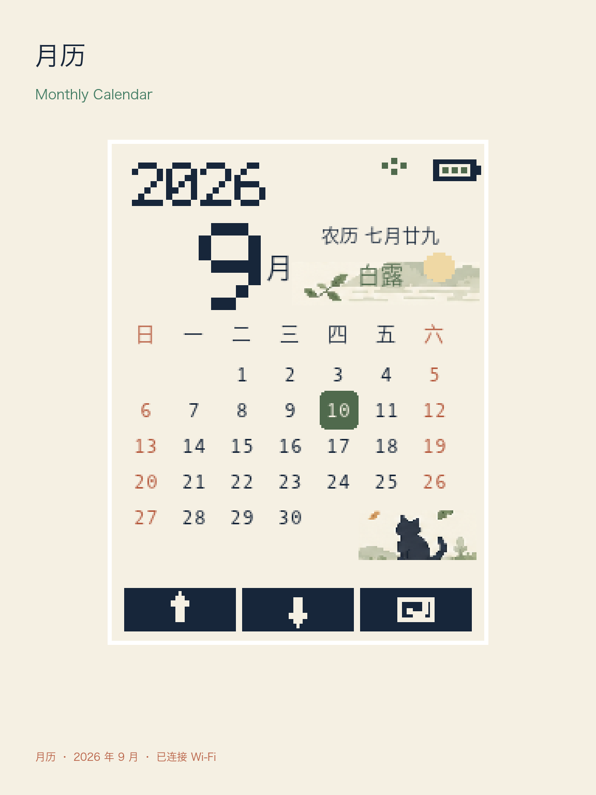
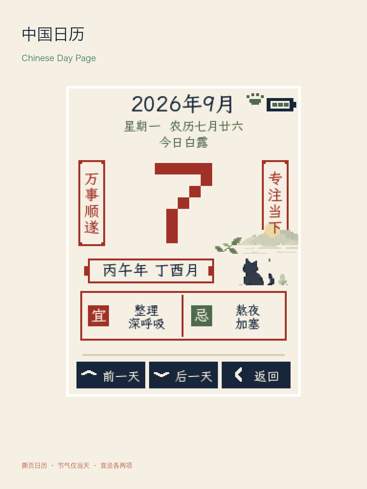
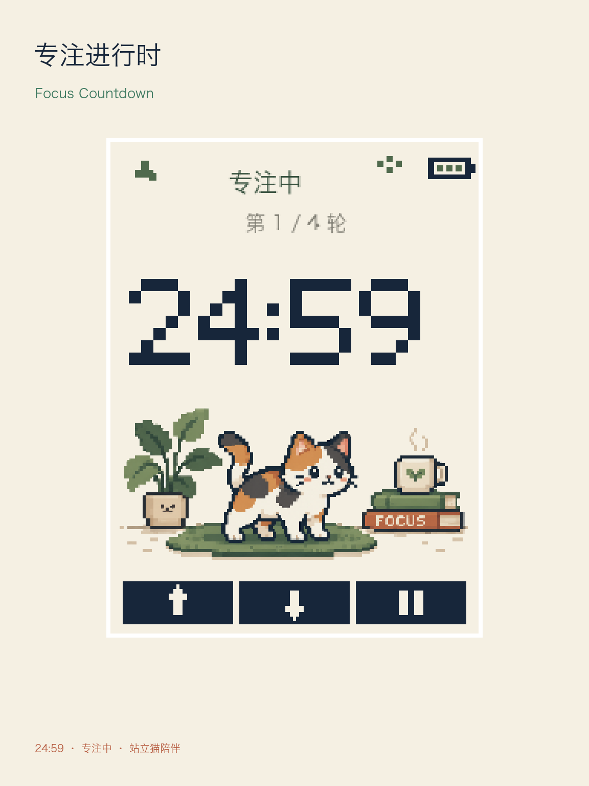

  <a href="README.zh_CN.md">简体中文</a> · <strong>English</strong>

# Cat Focus Calendar

Cat Focus Calendar is a pixel-art calendar and Pomodoro firmware for the
FoloToy AI Passport's 240 × 320 display. It combines a Gregorian calendar,
offline Chinese lunar information, a traditional tear-off-style daily page,
and a cat-focused timer.

## Current pages

- **Calendar** — boot page with month grid, selected Gregorian date, lunar
  date, solar term, and month navigation.
- **Chinese daily page** — a tear-off-style view with the day, weekday, lunar
  date, solar term, heavenly-stem/earthly-branch information, and lightweight
  focus suggestions. It is a personal daily prompt, not an authoritative
  traditional almanac.
- **Pomodoro** — 15, 25, and 45 minute focus intervals, pauses, breaks, NVS
  persistence, and pixel-art scenes. The cat stands awake during a running
  focus interval and rests at other times.
- **Wi-Fi setup** — BLE provisioning and NTP time sync, entered only when the
  user requests it. No home-network credential is stored in the source tree.
- **Idle display** — after ten minutes without a button event, the backlight is
  set to zero while the current page and timer state remain in memory. The first
  `CLICK` or `LONG` event wakes the display only; press again to operate the UI.

## Page previews

The following are rendered previews based on the checked-in firmware layouts
and pixel assets. They are not photographs or serial captures from a physical
device; physical display acceptance remains tracked below.

  
  
  

## Three-button controls

| From the calendar | Action |
| --- | --- |
| `UP` / `DOWN` | Previous / next month |
| Long `UP` | Open the Chinese daily page |
| Long `DOWN` | Open Wi-Fi setup |
| `OK` | Open Pomodoro |

On the Chinese daily page, `UP` and `DOWN` move one day backward and forward;
`OK` returns to the calendar. On Pomodoro, `UP` changes the idle duration,
`DOWN` returns to the calendar without stopping an active timer, and `OK`
starts, pauses, resumes, or starts a suggested break.

## Data and implementation

Lunar dates and the 24 solar terms use a generated, offline 1900–2100 lookup
table. Fixed pixel scenes are RGB565 assets stored in Flash; time, state,
lunar data, selection, battery, Wi-Fi, and input remain live code. This keeps
the ESP32-C3's no-PSRAM LVGL memory pool available for the UI.

See [the product page specification](docs/pixel-clock-v1.md),
[the art-asset guide](assets/images/pixel-clock/README.md), and
[the hardware development guide](docs/hardware-design/AI_HARDWARE_DEVELOPMENT_GUIDE.md)
for build, provisioning, and device-validation details.

## Validation status

The calendar and Pomodoro host models passed in the last verified firmware
snapshot. The newer idle-backlight update still needs an ESP-IDF build and
physical-device validation; this machine currently lacks the ESP-IDF 5.5 Python
virtual environment. Visual appearance, button feel, and phone provisioning also
remain device-acceptance work.

## License

MIT. See [LICENSE](LICENSE).
