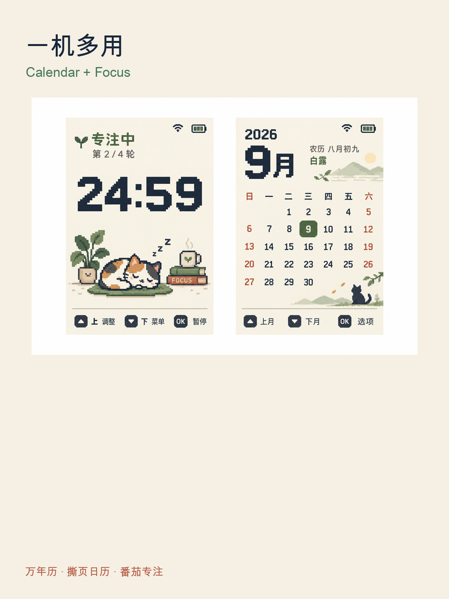

  <strong>简体中文</strong> · <a href="README.md">English</a>

# Cat Focus Calendar

Cat Focus Calendar 是运行在 FoloToy AI Passport 240 × 320 屏幕上的像素风日历与番茄钟固件。它将公历月历、离线农历、中国撕页日历和猫咪专注计时结合在一起。

## 当前页面

- **万年历**：开机页面，显示月份网格、选中公历日期、农历、节气与翻月操作。
- **中国日历**：撕页日历风格，显示日期、星期、农历、节气、干支和轻量的专注建议。这里的「宜忌」是个人日程提示，不是权威传统黄历。
- **番茄钟**：15、25、45 分钟专注时段，支持暂停、休息和 NVS 持久化；专注计时进行中显示清醒站立的猫，其他状态显示休息猫。
- **Wi-Fi 配网**：按需进入 BLE 配网并通过 NTP 校时；源码中没有预置家庭 Wi-Fi 凭据。
- **闲置熄屏**：十分钟没有按键事件后，背光降为 0，当前页面和计时状态仍保留在内存中。首次 `CLICK` 或 `LONG` 只唤醒屏幕；再次按键才执行页面操作。

## 主要页面效果图

下图根据已入库的固件页面布局和像素资源渲染，用于展示当前页面效果；它们不是实体设备照片或串口截屏。真机屏幕的最终验收仍以本文后面的验证状态为准。

  
  
  

## 三按键操作

| 万年历页面 | 操作 |
| --- | --- |
| `UP` / `DOWN` | 上一个 / 下一个月份 |
| 长按 `UP` | 进入中国日历 |
| 长按 `DOWN` | 进入 Wi-Fi 配网 |
| `OK` | 进入番茄钟 |

在中国日历中，`UP`、`DOWN` 分别查看前一天、后一天，`OK` 返回万年历。番茄钟待开始时 `UP` 切换时长，`DOWN` 回到万年历而不中断正在运行的计时，`OK` 用于开始、暂停、继续或开始提示的休息阶段。

## 数据与实现

农历与二十四节气使用生成后的 1900—2100 离线查表。固定像素插画作为 RGB565 资源存放在 Flash；时间、状态、农历、选中日期、电量、Wi-Fi 和按键状态均由代码实时绘制，从而为无 PSRAM 的 ESP32-C3 留出 LVGL 内存。

构建、配网和真机验证请查看[产品页面说明](docs/pixel-clock-v1.zh_CN.md)、[插画资源说明](assets/images/pixel-clock/README.zh_CN.md)与[硬件开发指南](docs/hardware-design/AI_HARDWARE_DEVELOPMENT_GUIDE.zh_CN.md)。

## 验证状态

日历和番茄钟主机模型已在上一份经过验证的固件快照中通过。新增的闲置背光功能仍需 ESP-IDF 构建和真机验证；当前机器缺少 ESP-IDF 5.5 所需的 Python 虚拟环境。实际屏幕效果、实体按键手感和手机配网也仍需在真机上验收。

## 许可证

MIT，见 [LICENSE](LICENSE)。
